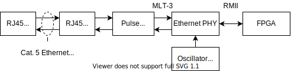
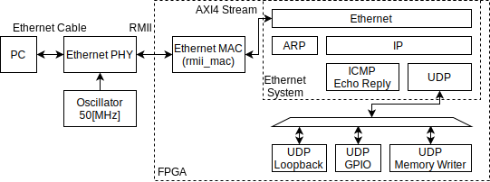
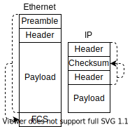

# 格安FPGAボード <br/>Tang Nano 9K/Primer 20Kで試す <br/>FPGA Ethernet通信

<!--
_class: lead
_paginate: false
_header: ""
-->

<style>
img[alt~="center"] {
  display: block;
  margin: 0 auto;
}
</style>

## 自己紹介


* 井田　健太
* FPGAの論理設計屋だった気がする
* 最近は組込みRust屋になった気がする
  * ESP32とか

## 今回のネタ：FPGA Ethernet通信

* CPU・ソフトウェアを使わずにEthernet通信
  * Ethernet, ARP, ICMP, IP, UDP
* UDP経由でPC等からUDPパケットを受信
* 処理結果のUDPパケットを返信
* 格安FPGAボード Tang Nano 9K / Tang Primer 20Kで実装

## 使用するハードウェア

* FPGAボード **Tang Nano 9K**
* Ethernet PHYボード

もしくは

* FPGAボード **Tang Primer 20K**

## Tang Nano 9K


* Sipeedが製造しているFPGAボード
* GOWIN LittleBee GW1NR-LV9QN88PC6/I5 搭載
  * LUT4 8640, FF 6480, BSRAM 468Kbit
  * PSRAM 64Mbit
* 秋月電子通商で2480円で買える

## Ethernet PHYボード


* Microchip LAN8720A 搭載
  * 100BASE-TX Ethernet PHY
  * **RMII** インターフェース
* WaveShareが搭載ボードを販売
  * https://www.waveshare.com/lan8720-eth-board.htm
* Amazonにクローン品があるので今回はこれを使用

## Tang Primer 20K (1/2)


* Sipeedが製造しているFPGAボードその2
* GOWIN Arora GW2A-LV18PG256C8IC8I7
  * LUT4 20736, FF 15552, BSRAM 828Kbit
* オンボード DDR3 128[MiB]
* DDR3 SODIMM形状のモジュール
* モジュール用Dock 2種類
* まだ秋月で買えないのでaliexpressから買う

## Tang Primer 20K (2/2)

* 高機能版DockにはEthernet PHYが載っている
  * Realtek **RTL8201F-VB-CG**


## やったこと


* UDPでPCから64x32の8色画像データを送信
* FPGA側でUDPパケットを受信してメモリに書き込み
* メモリの内容を64x32のカラーマトリクスLED(HUB75E) に出力

## 構成 (1/5)

* Ethernet PHYとFPGA間は **RMII** で接続
* Ethernet PHYにはクロック 50[MHz]を接続



## 構成 (2/5)

* **Ethernet System** 入力したEthernetフレームを処理
  * EthernetフレームをAXI4 Streamで入出力可能にする



## 構成 (3/5)

* **Ethernet MAC (rmii_mac)** RMIIとAXI4 Streamの変換
  * 受信フレームをARP, IP, ICMP, UDPに分類・処理
  * 送信フレームの各プロトコル・ヘッダの構築


## 構成 (4/5)

* UDPのサービス3つを実装 - Loopback, GPIO, Memory Writer
  * Loopback - 受信データをそのまま送信
  * GPIO - パケット内容にしたがってGPIO入出力


## 構成 (5/5)

* UDPのサービス3つを実装 - Loopback, GPIO, Memory Writer
  * Memory Writer - 受信したデータをメモリへ書き込み
    * 開始アドレス、データを受信して書き込み


## UDPの処理 (1/6)

* UDPの処理のうち、一番面倒なのは **チェックサム** の計算
  * IPのヘッダー・チェックサム
  * UDPのチェックサム

## UDPの処理 (2/6)



* c.f. EthernetのFCS
  * FCSはフレーム末尾にある
  * チェックサムは各プロトコルのヘッダにある
* ヘッダ送信前に後続するペイロードを読む必要がある！

## UDPの処理 (3/6)

* 面倒なところはサボる
  * UDPのチェックサムは省略可能 (0を入れる)
  * IPv4の場合のみ省略可能
  * IPv6はIPにチェックサムがないのでUDPチェックサムは必須

## UDPの処理 (4/6)

* IPv4ヘッダの更新
  * 合成時にIPヘッダのうち固定の部分のチェックサムを計算
  * 実行時に変化したフィールド分、チェックサムを更新
    * 送信先アドレス
    * 長さ

## UDPの処理 (5/6)

* IP, UDPのチェックサム - Internetチェックサム
  * 2オクテット毎の **1の補数チェックサムの1の補数**
    * エンディアンに関係なく計算できる
  * 2の補数計算機で計算する場合、
    * アキュムレータに加算
    * 桁あふれが起きたら、あふれ分を最下位ビットに加算
    * 最後に1の補数 (ビット毎のNOT) をとる
* 部分更新できるのか？

## UDPの処理 (6/6)

* RFC1624 <br/>Computation of the Internet Checksum via Incremental Update
  * https://datatracker.ietf.org/doc/html/rfc1624
* ヘッダの部分更新はL3スイッチ内部でも頻繁に行われる
* Eqn.3に更新時の式が書いてある。 
```
HC' = ~(C + (-m) + m') = ~(~HC + ~m + m')
HC : 古いチェックサム,  C : 古いヘッダの1の補数の合計
HC': 新しいチェックサム, C': 新しいヘッダの1の補数の方形
m  : 古いフィールドの値, m': 新しいフィールドの値
```

## リソース

* Ethernet MAC + UDPパケット処理 + LEDダイナミック制御
  * LUT4: 2579/20736
  * SSRAM: 3
  * FF: 1773/16173
  * BSRAM: 7/46

* 小規模RISC-V CPU 1つ分くらいのサイズ
  * IPスタック入れるともっとメモリが必要
* 簡単なコマンド送受信回路としてはアリ

<!-- 
## HUB75E (1/2)


* カラーLEDを64列x16n行並べた、カラーLEDマトリクス・モジュール
* スイッチサイエンスやShigezone、aliexpressで買える
* 同じ型式なのに仕様違いのものがいろいろあって制御が大変らしい


## HUB75E (2/2)


* 基本的にはダイナミック点灯で制御
  * 64ピクセル分のRGB3bit画素データをクロックとパラレル信号で入力・ラッチ
  * 行セレクト信号を順次切り替えて、ラッチしたデータを表示する行を切り替え
  * ↑を高速に切り替えて画面表示
* 基本的にFPGA向きの制御方式
  * CPUでやりたけりゃLovyanGFXを使おう -->

## デモ

* 時間があれば

## まとめ

* 100BASE-TXでUDP送受信は割と簡単に実装可能
* 回路規模は小規模CPU1つ分
  * CPU実装するよりメモリは少なくて済む
* Tang Nano 9K / Tang Primer 20K安くて良い
  * Tang Nano 9Kは秋月でも買える
* 安価にFPGA UDP通信試せるのでお試しあれ 

## ソースコード

* https://github.com/ciniml/fpga_samples/tree/main/eda/ethernet_icmp