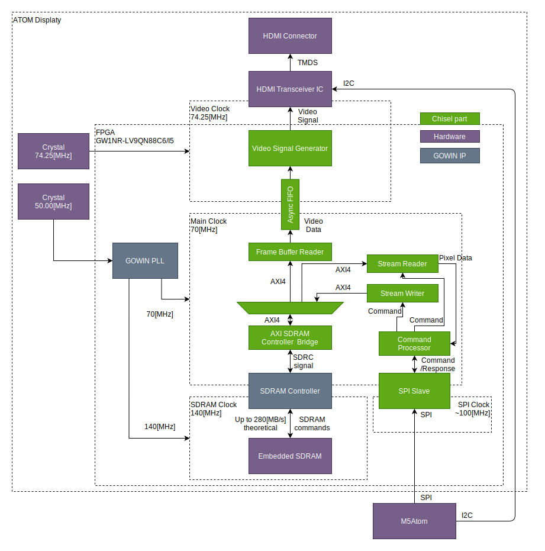

# 入門向けFPGA決定戦？ GOWIN FPGAボードのすすめ

実践的！FPGA開発セミナーvol.19 LT

<!--
_class: lead
_paginate: false
_header: ""
-->

## 自己紹介

* 井田　健太
* FPGAの論理設計屋だった気がする
* 最近は組込みRust屋になった気がする
  * ESP32とか

## 入門向けFPGAボード

* 入門 = FPGA初学者向け
* FPGA初学者
  * HDL含めてこれから習得する人
* いくつかの要件がある
  * 入手性
  * 情報の多さ
  * 価格
  * 機能

## 入手性

* 国内の企業から買えるかどうか
  * メールお問い合わせとか無く通常の通販サイトで買えるかどうか
  * e.g. 秋月電子通商の通販で買える等
* 在庫が豊富か
  * 在庫がなくなりやすい、LTが長い、流通在庫のみなどではない
* 国外でもdigikeyやmouserから買えるかくらいが限界
  * 初学者にはこれでもハードルが高い

## 情報の多さ

* みんな使ってるFPGAの方が当然、情報量は多い
  * このあたりは2大ベンダー (AMD, Intel) が有利
* 情報発信を継続して行っている人が居る
  * FPGAの部屋 - AMD有利
  * ACRi Blog - まだAMD率が高い
  * (私は元AMDユーザーなのでIntel事情あまり知らない)
* FPGAマガジンのバックナンバーに記事がある

## 価格

* 理想的にはマイコンボードくらいの価格が良い
  * 数千円
  * ついうっかり手をだせる価格
* 円安等の影響でかなり価格が上がっている
  * 2大ベンダーのまともなボードは軒並み2万円越え

## 機能 (1/2)

* もちろんいろいろできる方がいい
* 無償利用可能な開発環境で行えることが重要
  * 開発環境のライセンスはボードの価格より高いので…
* AMDがかなり有利
  * 無償範囲で使えるIPが多い
  * フルセットの高位合成環境が使える

## 機能 (2/2)

* 必要な機能は何をきっかけにFPGAを触りたいと思ったかによる
* とりあえず触ってみたい
  * 映像出力とかできるとある程度面白い？
* カメラの画像処理がしたい！
  * カメラ入力、映像出力
* CPU実装してみたい！
  * それなりの規模のFPGAならなんでもよさそう
* ネットワーク！
  * Ethernetつながるやつにしよう

## 入手性のよさそうなFPGAボード(1/5)

| ボード名          | 製造元   | FPGA            |  価格 | 特徴                         |
| :---------------- | :------- | --------------- | ----: | :--------------------------- |
| TE0726-03-41C64-A | Trenz    | Zynq XC7Z010    | 21480 | Raspberry Pi形状のZynqボード |
| ARTY S7           | Digilent | Spartan7 XC7S50 | 22440 | 使いやすいSpartan7ボード     |
| ARTY A7-35        | Digilent | Artix7 XC7A35   | 23480 | 小規模Artix7ボード           |

## 入手性のよさそうなFPGAボード(2/5)

| ボード名    | 製造元   | FPGA          |  価格 | 特徴                               |
| :---------- | :------- | ------------- | ----: | :--------------------------------- |
| CORA Z7-07S | Digilent | Zynq XC7Z007S | 22000 | Zynq系最小規模                     |
| CORA Z7-10  | Digilent | Zynq XC7Z010  | 24100 | お手頃？Zynqボード                 |
| ZYBO Z7     | Digilent | Zynq XC7Z010  | 33500 | 定番Zynqボード。情報多い           |
| PYNQ Z1     | Digilent | Zynq XC7Z020  | 42760 | PYNQシリーズ初代ボード HDMI IN/OUT |

## 入手性のよさそうなFPGAボード(3/5)

| ボード名   | 製造元 | FPGA                         |  価格 | 特徴                        |
| :--------- | :----- | ---------------------------- | ----: | :-------------------------- |
| LiteFury   | Xilinx | Artix-7 XC7A100T             | 16734 | M.2形状、PCIe遊び可能       |
| Kria KV260 | Xilinx | Zynq Ultrascale+ XCZU5EV相当 | 42587 | カメラ入力、H/264/265 CODEC |
| Kria KR260 | Xilinx | Zynq Ultrascale+ XCZU5EV相当 | 59690 | GbE, 10GbEで遊べる！        |

## 入手性のよさそうなFPGAボード(4/5)

* Intel系は今は入手性がかなり悪い…
  * 現時点でdigikey/mouserで在庫あるのこれくらいしか見つけられなかった
  * Agilex3期待してます

| ボード名 | 製造元  | FPGA                         |  価格 | 特徴                  |
| :------- | :------ | ---------------------------- | ----: | :-------------------- |
| T-Core   | Terasic | MAX10 10M50DAF               | 20775 | まだ買えるMAX10ボード |

## 入手性のよさそうなFPGAボード(5/5)

| ボード名               | 製造元 | FPGA                      |   価格 | 特徴                     |
| :--------------------- | :----- | ------------------------- | -----: | :----------------------- |
| Tang Nano 9K           | Sipeed | LittleBee GW1NR-LV9PC6/I5 |   2480 | DVI映像出力              |
| Tang Primer 20K + Dock | Sipeed | Arora GW2A-LV18           |   6880 | DVI映像出力、100BASE-TX  |
| Tang Nano 20K          | Sipeed | Arora GW2AR-LV18          | 未発売 | たぶんPrimer 20Kより安い |

## おまけ：価格が安かったが終売のボード

* Intel系はTrenzから安価で便利なボードが出ていた
* 終売らしい… 残念

| ボード名 | 製造元 | FPGA                | 価格 | 特徴   |
| :------- | :----- | ------------------- | ---: | :----- |
| MAX1000  | Trenz  | MAX10 10M08         | 4780 | 安い！ |
| CYC1000  | Trenz  | Cyclone10LP 10CL025 | 4900 | 安い！ |

## 一覧表

* Google Spreadsheetにまとめておきました。
* https://docs.google.com/spreadsheets/d/e/2PACX-1vQ3g3hP8YLRfTDaKJNNuwWqaVlPn9l2qi8h0QCMJiUsb0z2IqMmRJ_ygFK7EodRKH1Y7fu1HfC493h-/pubhtml

## 結論？

* だいたい1万円越えでつらい
* GOWIN FPGA安くて良さそうだね！
* ところでGOWIN FPGAってどんなものなの？

## GOWIN FPGAについて

* 中国 GOWIN が製造しているFPGA
  * 国内正規代理店は丸文
* 小～中規模のFPGA
  * LittleBee: 1k~9k LUT4 55nmLP
  * Arora: 20k~50k LUT4 55nm
  * Arora V: 20k~50k LUT4 22nm
* ファミリ間でアーキテクチャはほぼ同じ
  * Arora Vは高速トランシーバがある (>10Gbps)

## 開発環境

* GOWIN EDA
  * 論理合成・配置配線
  * IPコアの生成
* 2種類のEdition
  * Standard: 要ライセンス申請 (無償)
  * Education: ライセンス申請不要

## GOWIN EDAの機能

* VHDL2008, SystemVerilog 2017入力の合成
  * 各言語機能にどれくらい対応するかは要確認
* GOWINが提供する各種IPコアのカスタマイズと生成
* FPGA自体のJTAGによるコンフィグレーション
* FPGA内蔵フラッシュ等へのビットストリーム書き込み
* デバッグ用ロジックアナライザ回路の埋め込みと操作

## デバッグ機能 GOWIN Analyzer Oscilloscope

* 合成前・合成後のデザインにロジック・アナライザ機能を埋め込み
  * GUI上からトリガソース、クロック、記録対象のネットを設定

## デバッグ機能 GOWIN Analyzer Oscilloscope

* 書き込み後、トリガ条件などを設定して取り込み開始
* JTAG経由で取り込んだ波形を画面に表示

## GOWIN EDAに無い機能

* IPベース設計ツール
  * 現在のところIPコアのインスタンス化と接続は手動
* シミュレータ
  * 別途商用のシミュレータ等を用意する必要あり

## GOWIN EDA所感(1/2)

* 良くも悪くもシンプル
  * 現在の2大ベンダーのツールと比べて機能が少ない
* 初学者はむしろ混乱しなくて良いのではないか
* 最低限の機能はある
  * デバッグ用のロジックアナライザ機能

## GOWIN EDA所感(2/2)

* シミュレータはOSSでなんとかする
  * Icarus Verilog
  * Velirator
  * Chiselを使う (おすすめ)

* 初めのうちは高度な機能使わないので問題ない
  * とはいえSystemVerilogの基本的な機能も一部制限があるので対策は必要

## Tang Nano 9K

* LittleBee GW1NR-LV9
  * 8640 LUT4, 6480 FF
* 秋月で2480円
* HDMI(DVI)出力
* 書き込み回路搭載
  * USB-C接続で書き込み可能

## 入門向けのベースボード

* Tang Nano 9Kはオンボード機能があまり多くない
* ブレッドボード配線は間違いやすい
  * 初学者には辛い
* Pmodモジュールを
  簡単につなげられるとよさそう
* ボード発注済み (たぶん今週中に届く)
* 秋月で買える部品のみで構成
* 基板のみ、部品付き、実装済みで頒布予定

## 宣伝： 2500円ボードで始めるFPGA開発 Vol.2

* Interface 2022年12月号の別冊付録 (CQ出版)
  * 2022年10月25日発売
* 鈴木さん、望月さん、井田の3名で執筆
* Tang Nano 9Kの使用方法・使用例を紹介
  * GOWIN EDAのインストール手順
  * デザインの合成と書き込み
* 3日後に出る **Interface 2023年4月号** にも Tang Primer 20Kの紹介が少しあります

## 今後の予定

* GOWINにも高位合成ほしい！
  * Google XLSを試す予定 (ビルドしてサンプルは試した)
* IPベース設計は？
  * Chiselで解決？
  * FuseSoCを試す？

## まとめ！

* 従来の初学者向けFPGAボードの価格が高騰している
  * 1万円台ですらきびしい
* デカい画処理などやりたいのであれば、Xilinx KV260一択
* 10GbEで遊びたい - Xilinx KR260買おう
* それ以外でとりあえず試したい場合
  * SipeedのGOWIN FPGAボードは秋月で数千円で買える
  * 初学者が学ぶには十分な機能がある
  * GOWIN FPGAボードでFPGAを触ってみよう！

<!-- ## 実装例

* M5Stack ATOM Display / Display Module
  * マイコン (ESP32) からSPIでコマンドを受けて、HDMIディスプレイに画像を出力するディスプレイ・コントローラー
  * 中身は **LittleBee GW1NR-LV9**
  * Chisel + SystemVerilog

https://docs.m5stack.com/en/module/Display%20Module%2013.2

## ブロック図

* SPIからコマンドを受ける
  * 矩形塗りつぶし
  * 矩形領域ピクセル値更新
* Stream Reader/Writer = Video DMAみたいな矩形転送するDMA
* フレームバッファ読み出し -> Video信号出力

 -->
