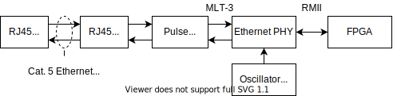
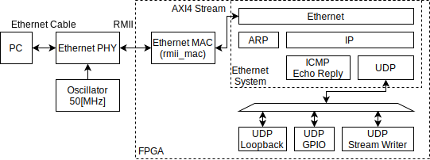
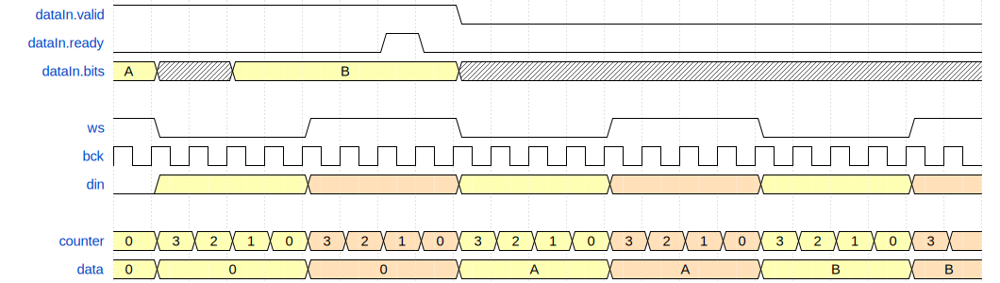
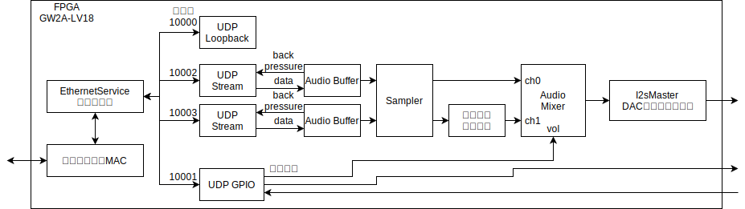

# 格安FPGAで始めるFPGA Ethernet:<br/> UDPオーディオ編

実践的！FPGA開発セミナーvol.26 

<!--
_class: lead
_paginate: false
_header: ""
-->

<style>
img[alt~="center"] {
  display: block;
  margin: 0 auto;
}
</style>

## 自己紹介


* 井田　健太
* FPGAの論理設計屋だった気がする
* 最近は組込みRust屋になった気がする
  * ESP32とか

## GOWIN FPGAについて

* 中国 GOWIN が製造しているFPGA
  * 国内正規代理店は丸文
* 小～中規模のFPGA
  * LittleBee: 1k~9k LUT4 55nmLP
  * Arora: 20k~50k LUT4 55nm
  * Arora V: 20k~50k LUT4 22nm
* ファミリ間でアーキテクチャはほぼ同じ
  * Arora Vは高速トランシーバがある (>10Gbps)

## Tang Primer 20K (1/2)


* Sipeedが製造しているFPGAボードその2
* GOWIN Arora GW2A-LV18PG256C8IC8I7
  * LUT4 20736, FF 15552, BSRAM 828Kbit
* オンボード DDR3 128[MiB]
* DDR3 SODIMM形状のモジュール
* モジュール用Dock 2種類

## Tang Primer 20K (2/2)

* 高機能版DockにはEthernet PHYが載っている
  * Realtek **RTL8201F-VB-CG**
* 秋月で高機能版Dockとのセットが6880円
  * https://akizukidenshi.com/catalog/g/gM-17540/
* FPGA Ethernet遊びに最適！


## やったこと

* UDPでPCから音声データを送信
* FPGA側でUDPパケットを受信して音声データにいろいろ処理
  * 移動平均フィルタ
  * 2チャネルのミキシング
* Dock搭載のオーディオDACから音声出力

## UDP処理部の構成 (1/5)

* Ethernet PHYとFPGA間は **RMII** で接続
* Ethernet PHYにはクロック 50[MHz]を接続



## UDP処理部の構成 (2/5)

* **Ethernet System** 入力したEthernetフレームを処理
  * EthernetフレームをAXI4 Streamで入出力可能にする



## UDP処理部の構成 (3/5)

* **Ethernet MAC (rmii_mac)** RMIIとAXI4 Streamの変換
  * 受信フレームをARP, IP, ICMP, UDPに分類・処理
  * 送信フレームの各プロトコル・ヘッダの構築


## UDP処理部の構成 (4/5)

* UDPのサービス3つを実装 - Loopback, GPIO, Stream Writer
  * Loopback - 受信データをそのまま送信
  * GPIO - パケット内容にしたがってGPIO入出力


## UDP処理部の構成 (5/5)

* UDPのサービス3つを実装 - Loopback, GPIO, Stream Writer
  * Stream Writer - 受信したデータをAXI4 Streamで出力
    * バッファ空き通知によるback pressure機能あり


## UDPの処理 (1/6)

* UDPの処理のうち、一番面倒なのは **チェックサム** の計算
  * IPのヘッダー・チェックサム
  * UDPのチェックサム

## UDPの処理 (2/6)


* c.f. EthernetのFCS
  * FCSはフレーム末尾にある
  * チェックサムは各プロトコルのヘッダにある
* ヘッダ送信前に後続するペイロードを読む必要がある！

## UDPの処理 (3/6)

* 面倒なところはサボる
  * UDPのチェックサムは省略可能 (0を入れる)
  * IPv4の場合のみ省略可能
  * IPv6はIPにチェックサムがないのでUDPチェックサムは必須

## UDPの処理 (4/6)

* IPv4ヘッダの更新
  * 合成時にIPヘッダのうち固定の部分のチェックサムを計算
  * 実行時に変化したフィールド分、チェックサムを更新
    * 送信先アドレス
    * 長さ

## UDPの処理 (5/6)

* IP, UDPのチェックサム - Internetチェックサム
  * 2オクテット毎の **1の補数チェックサムの1の補数**
    * エンディアンに関係なく計算できる
  * 2の補数計算機で計算する場合、
    * アキュムレータに加算
    * 桁あふれが起きたら、あふれ分を最下位ビットに加算
    * 最後に1の補数 (ビット毎のNOT) をとる
* 部分更新できるのか？

## UDPの処理 (6/6)

* RFC1624 <br/>Computation of the Internet Checksum via Incremental Update
  * https://datatracker.ietf.org/doc/html/rfc1624
* ヘッダの部分更新はL3スイッチ内部でも頻繁に行われる
* Eqn.3に更新時の式が書いてある。 
```
HC' = ~(C + (-m) + m') = ~(~HC + ~m + m')
HC : 古いチェックサム,  C : 古いヘッダの1の補数の合計
HC': 新しいチェックサム, C': 新しいヘッダの1の補数の方形
m  : 古いフィールドの値, m': 新しいフィールドの値
```

## オーディオDACの制御 (1/4)

* Tang Nano 20KのオーディオDAC - PT8211
  * ステレオ16bit DAC
  * 384[kHz]までの音声信号に対応
* 入力はI2Sっぽいプロトコル
  * LSBJ (Least Significant Bit Justified) と呼ばれる

| 信号名 | FPGAから見た方向 | 内容             |
| :----- | :--------------- | :--------------- |
| BCK    | 出力             | ビット・クロック |
| WS     | 出力             | ワード・セレクト |
| DIN    | 出力             | データ入力       |

## オーディオDACの制御 (2/4)

* bck ビット・クロック: クロック。立ち上がりエッジでラッチ
* ws  ワード・セレクト信号: 左右のチャネルを表す。0=左、1=右
* din データ信号




## オーディオDACの制御 (3/4)

* データ信号は MSb から送信
* WSは16サイクル固定でなくてもよい (最大384[kHz])
  * BCKの周波数により隙間ができる 
* WSの切り替わりの直前が LSb になるように詰める
  * MSbより前のDINの値は無視される


## オーディオDACの制御 (4/4)

* 音声信号をAXI4 Streamで入力して、DACに出力するモジュールを作成


## あとは直結するだけ？

* FPGA側はともかく、ホストからのデータ送信タイミングはばらつく
  * 遅れるとデータが必要なタイミングに間に合わなくなる
* バッファが必要

## オーディオ・バッファの作成

* ある程度バッファに蓄えてから再生を開始するバッファ
* バッファが空なら閾値を越えるまで出力しない
* 一度閾値を越えたら出力を開始する
  * FIFOのエントリ数を確認しておくだけなので簡単

## システム全体構成



## FPGA内部構成 (1/5)

* UDP Streamサービスを2チャネル分
  * 10002番, 10003番ポート
  * それぞれ個別のステレオ音声を入力可能




## FPGA内部構成 (2/5)

* チャネルごとにそれぞれオーディオ・バッファ (FIFO) を接続
  * 2048サンプル分のバッファ
  * 2048*3/4 = 1536 でバッファ空き通知を送信


## FPGA内部構成 (3/5)

* サンプリング・レートの周期でデータを取り出すサンプラー
  * データが無い場合はかわりに0を出力する
  * データが無い場合でも後続のストリームが一定周期で動くようになる


## FPGA内部構成 (4/5)

* 移動平均フィルタ (チャネル1のみ)
  * 8サンプルの移動平均フィルタ
  * FIRのローパス・フィルタの係数計算面倒だったのでかわりに…


## FPGA内部構成 (5/5)

* オーディオ・ミキサ
  * 各UDPポートからの音声データを任意の音量係数(0~32768)で加算
  * 音量値は10001番ポートのUDP GPIOから設定


<!-- 
## オーディオ・ミキサ

* 全チャネルの音声データに対して音量値を掛けてアキュムレータに加算
* アキュムレータをチャネル数で割る
  * 今回は2チャネルのみ



## オーディオ・ミキサの実装 (1/)

* 乗算と加算の繰り返しなのでHLSがいいのでは？
* しかし…
  * GOWIN EDAにはHLSの合成系は無い
  * Vitis HLS欲しいですね！

## オーディオ・ミキサの実装 (2/)

* xls (https://github.com/google/xls)
  * Googleが開発している高位合成系
  * フロントエンドとして独自言語 **dslx** と C++を使う **xslcc**
  * (System)Verilog を出力
* xlsccはC++だが
  Vitis HLSみたいに通常のC/C++コンパイラでコンパイルできるコードではない
  * ビット・ベクタ型などがgcc等でビルドできる形で提供されない
  * xlsccでテストコードも書くことになるのでつらい
* とりあえず **dslx** 試してみよう

## オーディオ・ミキサの実装 (3/)

```
proc mixer_body<N: u32, M: u32> {
    inputs_ch: chan<s16[M][N]> in;  // データ入力チャネル
    volumes_ch: chan<u16[M][N]> in; // 音量入力チャネル
    output_ch: chan<s16[M]> out;    // 結果出力チャネル
    
    init { () }

    config(inputs_ch: chan<s16[M][N]> in, volumes_ch: chan<u16[M][N]> in, output_ch: chan<s16[M]> out) {
      (inputs_ch, volumes_ch, output_ch)
    }

    next(tok: token, state: ()) {
      let (tok_volume, volumes) = recv(tok, volumes_ch);
      let (tok, inputs) = recv(tok, inputs_ch);
      let outputs = for (i, outputs) : (u32, s16[M]) in range(u32:0, M) {
        let acc = for(j, acc) : (u32, s32) in range(u32:0, N) {
          acc + ((inputs[j][i] as s32) * (volumes[j][i] as s32))
        }(s32:0);
        update(outputs, i, ((acc / (N as s32)) as u32)[-17:-1] as s16)
      }(s16[M]:[s16:0, ...]);
      send(tok, output_ch, outputs);
    }
}
``` -->

## リソース

* Ethernet MAC + UDPパケット処理 + オーディオ処理
  * LUT4: 3672/20736
  * SSRAM: 3
  * FF: 3050/16173
  * BSRAM: 14/46

## ホスト側構成 (1/2)




## ホスト側構成 (2/2)

* udpaudiosend: FPGAからのバッファ空き容量通知をみながらデータを送信
  * ffmpeg等からの音声データを標準入力から受け取って送信する
* udpaudiocontrol: オーディオ・ミキサの音量調整
  * UDP GPIO (10001番ポート) に各チャネルの音量値を送信する


## udpaudiosend

* 単にFPGAへのパケット送信と受信を繰り返してるだけ
  * 受信はタイムアウトするように設定 (いまのところ中身は見てない)

```Rust
socket.set_read_timeout(Some(Duration::from_millis(10)))?;
loop {
    let packet = receiver.recv().unwrap();
    if let Err(error) = socket.send_to(&packet, &args.destination) {
        log::error!("pattern send error: {}", error);
    }
    let mut buf = [0u8; 5];
    if let Ok((size, from)) = socket.recv_from(&mut buf) {
        if size == 5 {
            let remaining = u16::from_be_bytes([buf[1], buf[2]]);
            let maximum = u16::from_be_bytes([buf[3], buf[4]]);
            log::debug!("{}/{} from {}", remaining, maximum, from);
        }
    }
}
```

## 動作時の波形 (1/3)

* back presesureあり・なしでバッファの状態を比較
  * バッファが空かどうかをデバッグ用に出力して観測

```shell
# 通知なし, 送信元でレート制御
#   ffmpegの-reオプションで送信レート制御で直接送信
ffmpeg -re -i test.wav -f s16le -ar 48000 -acodec pcm_s16le  udp://192.168.10.2:10002?pkt_size=1024
# 通知あり, 受信側でレート制御 
#   udpaudiosendがFPGAからのバッファ空き通知を見ながら送信
ffmpeg -i test.wav -f s16le -ar 48000 -acodec pcm_s16le - | udpaudiosend
```

## 動作時の波形 (2/3)

* back pressureなし
  * 定期的にバッファが空になっている
  * 次のデータが届くまでの間にバッファが空になっている


## 動作時の波形 (3/3)

* back pressureあり
  * バッファが空にならない


## 宣伝：GOWIN FPGA小冊子 vol.3

* Interface 2023年12月号の別冊付録 (予定)
  * 2023年10月25日発売…かな？
* Tang Primer 20Kの使用方法・使用例を紹介
  * GOWIN EDAのインストール手順
  * デザインの合成と書き込み
* 今回のEthernet UDP Audioの詳細記事も載ります！

## 今後の予定

* もっと複雑なフィルタ処理 (FIR, IIR) の実装
* なんか音源とかも実装したい

## まとめ！

* Tang Primer 20KはEthernet UDPシステムに最適
  * 秋月で買える
  * Ethernet PHYがついている
  * 出力系が豊富
* UDP解析部を作っておくといろいろなストリーム系処理に繋げられて便利
  * ロジック規模もそこそこ
* FPGA UDP通信やろう！

<!-- ## 実装例

* M5Stack ATOM Display / Display Module
  * マイコン (ESP32) からSPIでコマンドを受けて、HDMIディスプレイに画像を出力するディスプレイ・コントローラー
  * 中身は **LittleBee GW1NR-LV9**
  * Chisel + SystemVerilog


https://docs.m5stack.com/en/module/Display%20Module%2013.2

## ブロック図

* SPIからコマンドを受ける
  * 矩形塗りつぶし
  * 矩形領域ピクセル値更新
* Stream Reader/Writer = Video DMAみたいな矩形転送するDMA
* フレームバッファ読み出し -> Video信号出力


 -->
